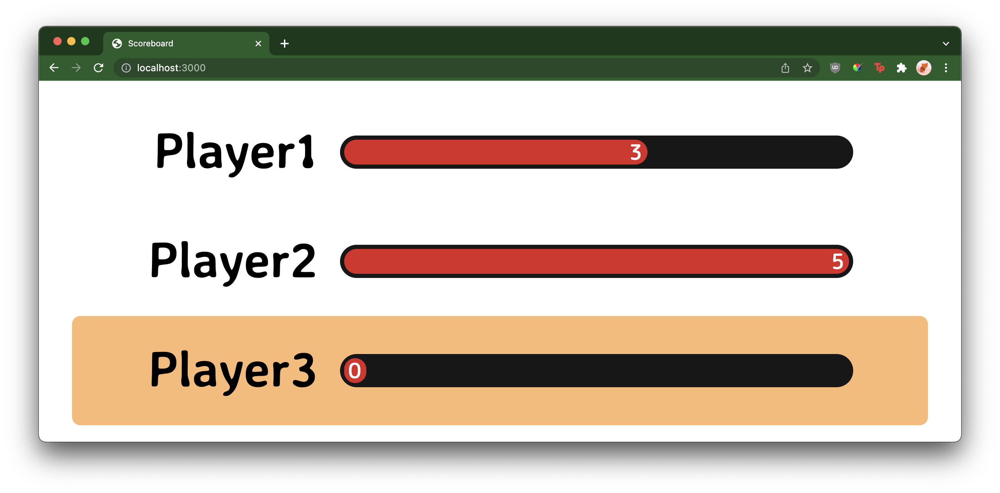

# Scoreboard

This is a simple project to display a scoreboard with various players, their
scores, and the maximum.

## Configuration

Configuration is done through `src/config.ts`. Player's rows may be highlighted
with the optional `highlight` property, based on the available highlights in
[`ScoreboardRow.tsx`](src/ScoreboardRow.tsx). A value of zero will not highlight
the row.
